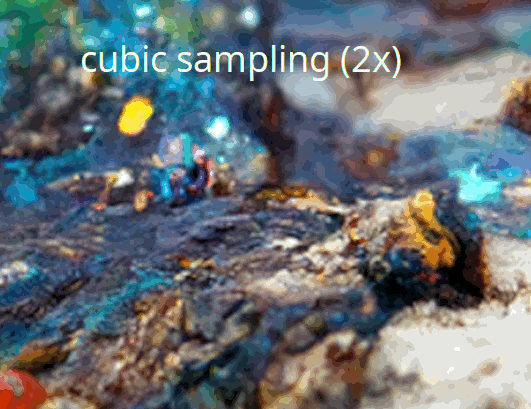
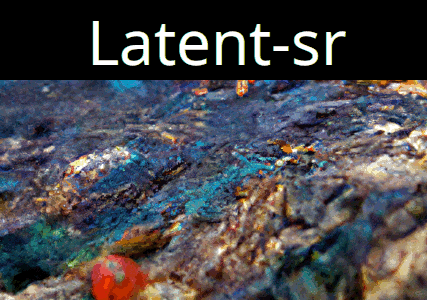
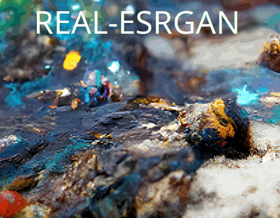

# Fast, memory efficient upscaling with iterative refinement

**Status:** Public Beta

Upscaling images often takes a lot of memory and time. Diff2X never sees the full image, and instead focuses on a sliding window of the full image. Therefore, there's little convolution going on in the model, as we already look at slices, and we have more control over stitching tiles back together.

**This allows us to:**

 - Selectively process harder parts of the image longer than others, making sure we don't have to denoise for long periods of time on the entire (even easy or blurry parts) of an image.

 - Run a noise estimation algorithm on each tile. Independent threads can denoise tiles and once they are below a certain threshold we can assume the quality is good enough there will be no noticeable decline.

 - Train Diff2X such that it never sees or has to reconstruct full images, meaning it can focus on details alone.

 - Scale up to infinitely high resolutions, as the memory requirement is constant (it does take longer for your image to complete, though).

The model is based on SR3. The main differences are:

- It upscales 2x from 32x32 to 64x64
- Trained on custom, curated subset of LAION-5B (only high scale images are used) 
- Very big hidden layers compared to SR3 (4 times the size of the input image)
- 3 instead of 5 upsampling layers
- Never trained on full images but on tiles

# Why make another upscaling model?

Since I deal with limited computation power (A single RTX3080) and haven't found a suitable hosting partner yet for my text-to-image Discord bot [Thingy](https://github.com/peterwilli/Thingy) (And the old upscaling algorithm is quite bad), I decided to make my own diffusion-based upscaling model.

It was also fun to learn how diffusion models tick from the ground up!

Previously, we used a custom upscaling that relied on:

- Take an image, add some noise to it
- Run diffusion model that generates images again with same settings but higher resolution, initialize it with the noisy image
- Wait until it is complete

Not only was it slow, the results weren't that good, and, sometimes it didn't work at all due having not enough memory! In addition, one is forced to run the same diffusion model and the same CLIP model (if you use it) just for upscaling.

I can run Diff2X with any resolution, and it's so tiny that it can easily run *in addition to* new images being generated, meaning I can offer more with the same hardware, and keep things free.

# Comparison to competitors

(Note that ESRGAN seems better in this case but the full picture [has a lot of artifacts](misc/demo_comparisons/real-esrgan_2x.png))

# Credits

- Kianne: For feedback, and being a great person to talk to. Thanks to them, I had my feet on the floor and a reality check once every while. They were way more experienced in the "actually open AI" ecosystem than I was and therefore am very grateful for their help and showing me what was there and what wasn't, allowing me to focus on the most important things.

- Anonymous member on Discord: For bringing me to the idea of using sliding windows as input rather than the whole image. Thanks to this contribution, the vision of "it's in the details" was executed even better! Before their idea, I was doing 256x256 to 512x512 tiles.

- [LAION](https://laion.ai) for their generous, open contributions across the field. Their LAION-5B dataset (and [clip-retrieval](https://pypi.org/project/clip-retrieval) to make a high-scale subset) were crucial to the development of Diff2X.  Without them there wouldn't be a model at all!

- [Image Super-Resolution via Iterative Refinement](https://github.com/Janspiry/Image-Super-Resolution-via-Iterative-Refinement) for making a PyTorch implementation of SR3.

# References

[**Image Super-Resolution via Iterative Refinement**](https://arxiv.org/abs/2104.07636)

*Chitwan Saharia, Jonathan Ho, William Chan, Tim Salimans, David J. Fleet, Mohammad Norouzi*

[**Fast Noise Variance Estimation**](https://www.sciencedirect.com/science/article/pii/S1077314296900600)

*John Immerkær*

Computer Vision and Image Understanding, Volume 64, Issue 2 1996

Pages 300-302

ISSN 1077-3142

https://doi.org/10.1006/cviu.1996.0060
